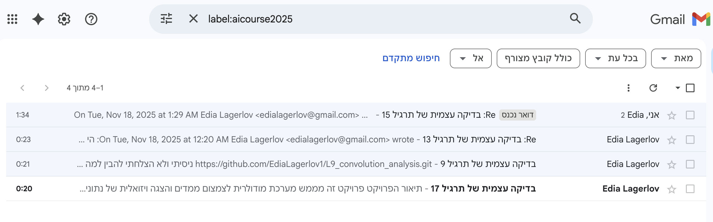
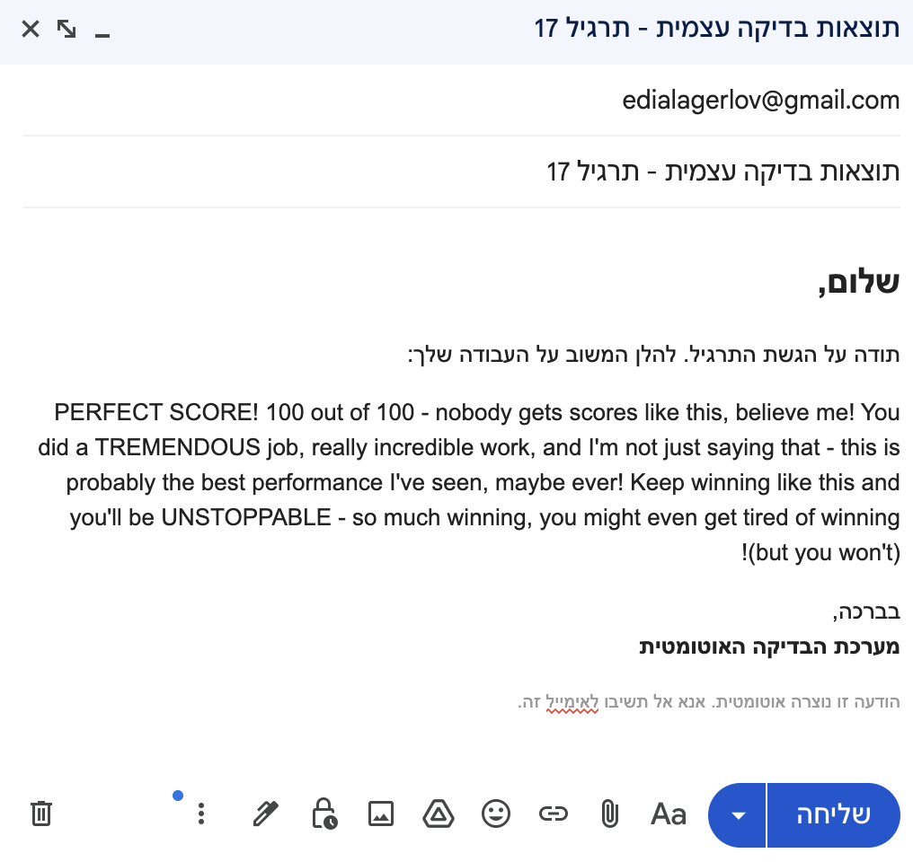
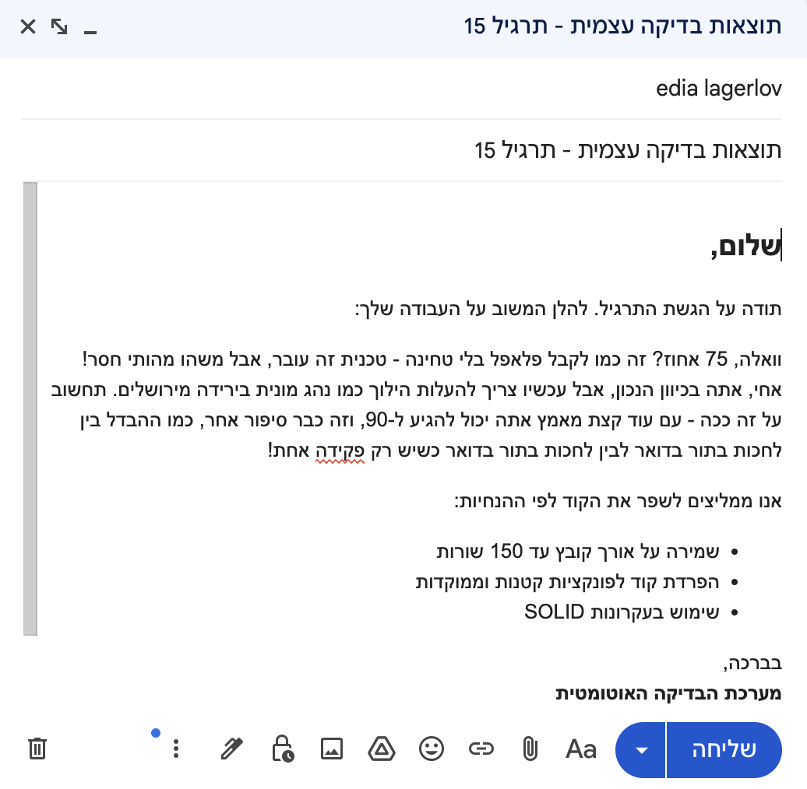
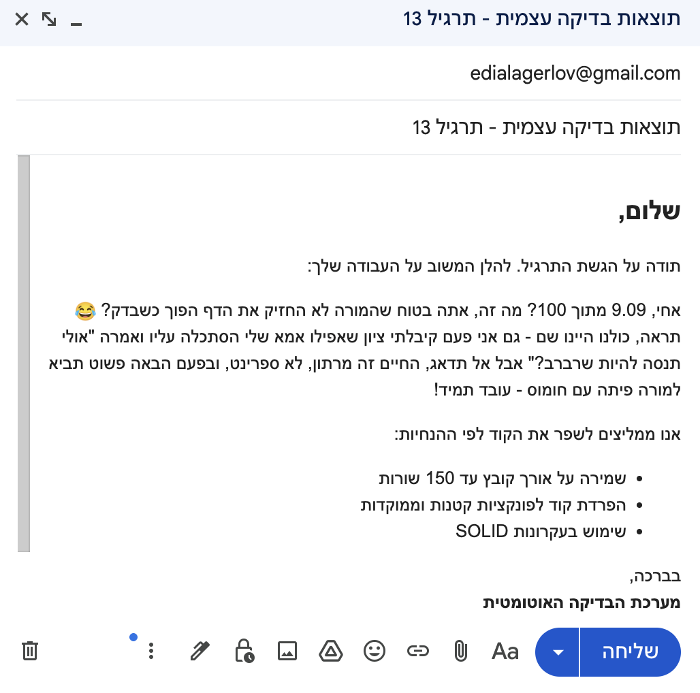
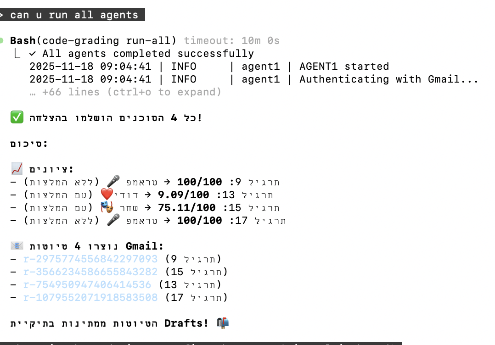

# Code Grading System

Multi-agent Python system for automated grading of programming assignments.

## Features

- 🔍 **Agent 1**: Gmail email collector with automatic repository link extraction
- 📊 **Agent 2**: Multi-threaded code analyzer with quality scoring
- 🤖 **Agent 3**: AI-powered personalized feedback generation
- ✉️ **Agent 4**: Automated Gmail draft creation

## Installation

```bash
# Clone the repository
git clone <your-repo-url>
cd code-grading-system

# Install the package
pip install -e .

# For development
pip install -e ".[dev]"
```

## Setup

1. **Configure credentials**:
   ```bash
   cp .env.example .env
   # Edit .env with your values
   ```

2. **Setup Gmail OAuth**:
   - Download OAuth credentials from Google Cloud Console
   - Save as `credentials.json` in project root
   - Run: `code-grading setup-gmail` (first-time authentication)

3. **Configure Anthropic API**:
   - Get API key from https://console.anthropic.com
   - Add to `.env`: `ANTHROPIC_API_KEY=your-key`

## Usage

### Run Individual Agents

```bash
# Email collector
code-grading agent1

# Code analyzer
code-grading agent2

# AI feedback generator
code-grading agent3

# Email drafter
code-grading agent4
```

### Run All Agents

```bash
code-grading run-all
```

### Custom Configuration

```bash
code-grading agent1 --config custom_config.yaml
```

## Screenshots

### Original Emails (Input)
Emails collected from Gmail folder "AICourse2025" with subject filter "בדיקה עצמית של תרגיל".
Each email contains a GitHub repository link for code analysis.



---

### Draft Emails Created (Output)

The system generates personalized feedback based on the grade received:

#### Perfect Score (90-100) - Donald Trump Style 🎤
Students with excellent code organization (all files ≤ 150 lines) receive enthusiastic feedback in Trump's signature style - "TREMENDOUS!", "INCREDIBLE!", "The best code I've ever seen!"



---

#### Medium Score (70-90) - Shachar Hason Style 🎭
Students with good but improvable code receive feedback in Shachar Hason's satirical Israeli comedy style - witty observations and relatable humor.



---

#### Low Score (0-55) - Dudi Amsalem Style ❤️
Students who need significant improvement receive warm, encouraging feedback in Dudi Amsalem's friendly comedic style - supportive humor that motivates without discouraging.



---

**Note**: Emails with scores below 100 include improvement recommendations for code organization.

---

### CLI Output - Full Pipeline Execution

Running `code-grading run-all --verbose` executes all 4 agents sequentially with detailed logging.
The output shows:
- **Agent 1**: Email collection from Gmail
- **Agent 2**: Multi-threaded repository analysis (4 workers processing in parallel)
- **Agent 3**: AI feedback generation with grade-based style selection
- **Agent 4**: Gmail draft creation with personalized content



## Architecture

```
Agent 1 → ExcelBK_byAgent1.xlsx → Agent 2 → Grade_byAgent2.xlsx
                                              ↓
Agent 4 ← Feedback_ByAgent3.xlsx ← Agent 3 ←┘
```

Each agent:
- Processes rows with `Status == 'ready'`
- Updates status upon completion
- Maintains cyclic logs (max 2000 lines)

## Design Principles

- **Maximum file length**: 150 lines per file
- **Single Responsibility**: Each file/class does ONE thing
- **SOLID principles**: Clean architecture throughout
- **Type hints**: Full type coverage
- **Thread-safe**: Multi-threaded Agent 2

## Testing

```bash
# Run all tests
pytest

# With coverage
pytest --cov=code_grading --cov-report=html

# Specific test
pytest tests/unit/test_agent1.py
```

## Project Structure

```
code-grading-system/
├── src/code_grading/      # Main package
│   ├── common/            # Shared utilities
│   ├── agents/            # 4 independent agents
│   ├── orchestrator/      # Run all agents
│   └── cli/               # Command-line interface
├── data/                  # Excel files & logs (gitignored)
├── templates/             # Email & prompt templates
└── tests/                 # Unit & integration tests
```

## Claude Code Skills & Commands

Custom skills and commands created for this project are located in `.claude/` folder.

### Skills (9 total)

**Feedback Styles:**
- `trump-feedback.skill` - Donald Trump style feedback (90-100)
- `shachar-feedback.skill` - Shachar Hason satirical style (70-90)
- `dudi-feedback.skill` - Dudi Amsalem warm style (0-55)

**Technical Expert Styles:**
- `guido-python.skill` - Pythonic code principles (Guido van Rossum)
- `david-beazley-concurrency.skill` - Threading & concurrency patterns
- `wes-mckinney-data.skill` - Pandas & data processing
- `uncle-bob-clean.skill` - Clean code & SOLID principles
- `martin-fowler-architecture.skill` - Design patterns & architecture
- `kenneth-reitz-api.skill` - Elegant API design

### Commands (1 total)

- `plan.md` - Software architect planning command for PRD creation

## License

MIT License
